<!-- Generated by GitHub Profile Agent Console. Edit profile.config.json, then run npm run generate. -->

  <picture>
    <source media="(max-width: 760px) and (prefers-color-scheme: dark)" srcset="./assets/hero/agent-console-b5196b91-mobile-dark.svg">
    <source media="(max-width: 760px)" srcset="./assets/hero/agent-console-b5196b91-mobile-light.svg">
    <source media="(prefers-color-scheme: dark)" srcset="./assets/hero/agent-console-b5196b91-dark.svg">
    <source media="(prefers-color-scheme: light)" srcset="./assets/hero/agent-console-b5196b91-light.svg">
    
  </picture>

  

## About Me

Software engineer building practical solutions with ML.

My work combines technical exploration with a builder mindset: understand the problem, test the system, and share what actually works.

## Current Focus

| Area | What I am exploring |
| --- | --- |
| **Machine Learning** | Building practical AI solutions that solve real-world problems. |
| **Applied AI** | Building reliable, maintainable software through clean code and testing. |
| **Software Engineering** | build plan code test and deploy |
| **Developer Tools** | Building tools that streamline development, debugging, and automation. |

## Featured Work

| Project | Focus | Why it matters |
| --- | --- | --- |
| [**AI tutor**](https://github.com/orion-pax09/AI-Tutor-Multi-Agent-Learning-Assistant.git) | python json api | Python AI learning assistant with specialized agents and tools. |
| [**discord meme bot**](https://github.com/orion-pax09/Discord_meme_bot.git) | python api | A Python Discord bot for automated memes, commands, and user interactions. |

## Research Direction

Agents / ML / Reliable Systems

## Tech Stack

`javascript` · `html` · `css` · `python` · `c++` · `sql`

## Recent Activity

<!-- AUTO:ACTIVITY:START -->
_Recent public activity will appear here after the workflow runs._
<!-- AUTO:ACTIVITY:END -->

---

  Building software, learning, and shipping projects.

